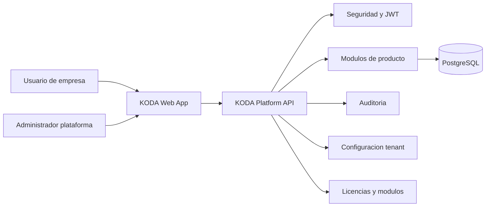
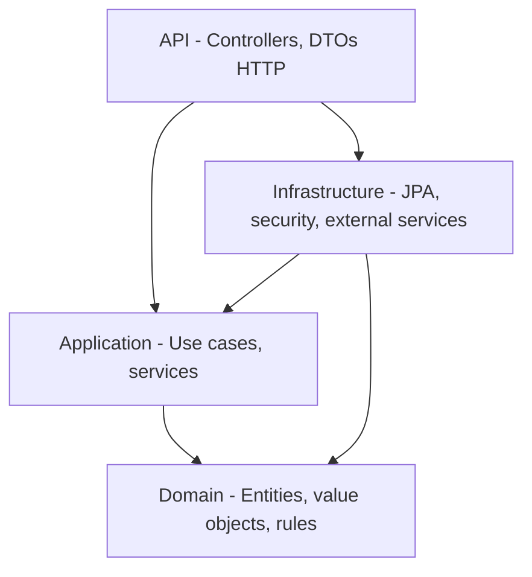

# KODA PLATFORM - Architecture

## 1. Objetivo arquitectonico

La arquitectura debe permitir construir una plataforma SaaS multiempresa, modular, segura y extensible. KODA ERP sera el primer producto, pero no debe condicionar el nucleo de plataforma ni impedir futuros productos como POS, CRM, BI, AI, Mobile o API.

La prioridad no es "hacer pantallas rapido". La prioridad es que cada pieza pueda sostener crecimiento, cambios de negocio y volumen real sin romper compatibilidad.

## 2. Estilo arquitectonico

Se aplicara Clean Architecture con dependencias apuntando hacia el dominio.

Capas:

- `domain`: reglas de negocio puras, entidades, value objects, eventos de dominio, contratos de repositorio.
- `application`: casos de uso, servicios de aplicacion, DTOs internos, puertos, validaciones de flujo.
- `infrastructure`: persistencia, integraciones externas, implementaciones de repositorios, seguridad tecnica, mensajeria, configuracion.
- `api`: controladores REST, DTOs de entrada/salida, mappers, manejo HTTP, documentacion OpenAPI.

Regla central:

> El dominio no conoce Spring, JPA, HTTP, JWT, PostgreSQL ni React.

## 3. Estructura propuesta del repositorio

```text
koda-platform/
  backend/
    pom.xml
    src/
      main/
        java/
          com/koda/platform/
            KodaPlatformApplication.java
            shared/
              domain/
              application/
              infrastructure/
              api/
            platform/
              tenants/
              products/
              licensing/
              configuration/
              audit/
              security/
            erp/
              products/
              stock/
              sales/
              purchases/
              cash/
              customers/
              suppliers/
              reports/
              dashboard/
        resources/
          db/migration/
          application.yml
          application-local.yml
      test/
        java/
          com/koda/platform/
  frontend/
    package.json
    vite.config.ts
    src/
      app/
      shared/
      platform/
      erp/
      assets/
      theme/
      routes/
      test/
  docs/
    diagrams/
    adr/
    api/
  docker/
    postgres/
  docker-compose.yml
  README.md
```

Esta estructura podra ajustarse durante el scaffolding, pero cualquier cambio debe preservar separacion por producto, modulo y capa.

## 4. Modelo modular

La plataforma tendra un catalogo de productos y modulos.

Conceptos:

- Producto: paquete comercial principal, por ejemplo `KODA_ERP`.
- Modulo: capacidad funcional activable, por ejemplo `STOCK`, `SALES`, `CASH`.
- Entitlement: permiso comercial que habilita un producto o modulo para un tenant.
- Feature flag: interruptor tecnico o gradual para funcionalidades especificas.

La activacion de modulos debe centralizarse. No se aceptan verificaciones dispersas tipo `if tenant has module` regadas por todo el codigo.

## 5. Multi-tenancy

### Estrategia inicial

Se recomienda usar base de datos compartida y esquema compartido con columna `tenant_id` obligatoria en entidades tenant-scoped.

Motivos:

- Escala mejor para miles de empresas pequenas y medianas.
- Simplifica migraciones globales.
- Permite reporting operativo y mantenimiento centralizado.
- Reduce costos de infraestructura inicial.

### Refuerzos obligatorios

- `tenant_id` obligatorio en tablas de datos de negocio.
- Resolver tenant desde contexto autenticado, no desde parametros libres enviados por el cliente.
- Filtros globales de tenant en repositorios y consultas.
- Tests que prueben aislamiento entre tenants.
- Auditoria con tenant, usuario, accion, timestamp y origen.
- Plan progresivo para Row Level Security de PostgreSQL en tablas criticas.

### Alternativa futura

Clientes enterprise podran requerir aislamiento dedicado por base o esquema. La arquitectura no debe impedirlo, pero no se implementara inicialmente salvo decision explicita del Product Owner.

## 6. Seguridad

### Autenticacion

- Spring Security.
- JWT firmado.
- Refresh tokens persistidos y revocables.
- Password hashing con algoritmo fuerte y parametros actualizables.
- Politica de expiracion configurable.

### Autorizacion

- RBAC por tenant.
- Permisos atomicos por modulo y accion.
- Roles configurables por empresa.
- Superadministrador de plataforma separado de administradores de tenant.
- Validacion de permisos en capa de aplicacion, no solo en controladores.

### Reglas criticas

- Nunca confiar en `tenant_id` enviado por el frontend.
- Nunca exponer entidades JPA directamente.
- Nunca devolver secretos, hashes, tokens ni configuraciones sensibles.
- Registrar intentos fallidos relevantes.
- Preparar defensa contra IDOR desde el primer sprint.

## 7. API

La API sera REST versionada.

Convenciones:

- Prefijo: `/api/v1`
- Recursos en plural: `/api/v1/products`
- DTOs de request y response separados.
- Errores normalizados.
- Paginacion obligatoria en listados.
- Filtros explicitamente soportados.
- Ordenamiento validado contra allowlist.

Formato de error recomendado:

```json
{
  "timestamp": "2026-07-14T10:30:00Z",
  "status": 400,
  "code": "VALIDATION_ERROR",
  "message": "Request validation failed",
  "details": [
    {
      "field": "name",
      "message": "must not be blank"
    }
  ],
  "traceId": "..."
}
```

## 8. Persistencia

### PostgreSQL

PostgreSQL sera la base operacional principal.

Lineamientos:

- Migraciones con Flyway.
- Claves primarias UUID o identificadores opacos.
- Indices por `tenant_id` y campos de busqueda frecuentes.
- Constraints de unicidad compuestas por tenant cuando corresponda.
- Soft delete solo cuando exista razon funcional o legal.
- Campos de auditoria estandarizados.

Campos base recomendados para entidades tenant-scoped:

- `id`
- `tenant_id`
- `created_at`
- `created_by`
- `updated_at`
- `updated_by`
- `deleted_at` cuando aplique
- `version` para optimistic locking cuando aplique

## 9. Auditoria

La auditoria debe cubrir:

- Creacion, actualizacion y eliminacion logica de registros sensibles.
- Login exitoso y fallido.
- Cambios de permisos, roles y configuracion.
- Movimientos de stock.
- Operaciones administrativas de plataforma.

La auditoria no debe depender solo de logs. Debe existir modelo persistido consultable.

## 10. Observabilidad

Desde el inicio:

- Logs estructurados.
- `traceId` y `correlationId`.
- Separacion clara entre errores esperados y fallas inesperadas.
- Health checks.
- Metricas preparadas para evolucion posterior.

## 11. Frontend

### Arquitectura

React + TypeScript + Vite + Material UI.

Estructura conceptual:

- `app`: bootstrap, providers, router, layout global.
- `shared`: componentes, hooks, utilidades, clientes HTTP.
- `platform`: login, tenants, seguridad, configuracion, licencias.
- `erp`: modulos ERP.
- `theme`: theming base y personalizacion por tenant.

### Principios UI

- Tema oscuro por defecto.
- Experiencia rapida para usuarios intensivos.
- Navegacion clara por productos y modulos.
- Formularios densos pero legibles.
- Estados de carga, vacio, error y permisos denegados.
- Componentes reutilizables, no pantallas clonadas.

## 12. Integracion backend/frontend

El frontend no debe codificar permisos o tenant como fuente de verdad. Puede usarlos para mejorar experiencia, pero el backend decide.

El cliente HTTP debe:

- Adjuntar token.
- Manejar refresh.
- Propagar `traceId` cuando aplique.
- Normalizar errores.
- Soportar cancelacion de requests.

## 13. Diagrama de contexto



## 14. Diagrama de capas



## 15. Decisiones tecnicas iniciales

| Decision | Estado | Motivo |
| --- | --- | --- |
| Clean Architecture | Aprobada por documento fundacional | Mantener independencia del dominio |
| Monorepo backend/frontend/docs | Propuesta inicial | Simplifica Sprint 1 y coordinacion temprana |
| Shared DB + shared schema + `tenant_id` | Propuesta inicial | Mejor equilibrio para SaaS multiempresa |
| REST `/api/v1` | Propuesta inicial | Simplicidad, versionado y compatibilidad |
| JWT + refresh token revocable | Propuesta inicial | Seguridad razonable para SaaS |
| Flyway desde primera migracion | Aprobada por stack | Control estricto de base de datos |

## 16. Riesgos principales

1. Sprint 1 tiene demasiadas capacidades para una sola iteracion si se pretende calidad empresarial.
2. Multi-tenancy mal aplicado produciria fugas de datos. Es el riesgo numero uno.
3. Si licencias/modulos se implementan tarde, se contaminara el codigo con condicionales dificiles de mantener.
4. Si auditoria se agrega al final, quedara incompleta.
5. Si el frontend nace como pantallas sueltas, sera caro convertirlo en plataforma.

## 17. Criterios arquitectonicos de aceptacion

Antes de cerrar una funcionalidad:

- La regla de negocio vive en dominio o aplicacion, no en controlador.
- La API expone DTOs, nunca entidades.
- Toda consulta tenant-scoped filtra por tenant de contexto.
- Los errores usan formato comun.
- Existen tests para casos exitosos, validaciones y accesos indebidos.
- La migracion Flyway es reversible conceptualmente aunque Flyway no ejecute rollback automatico.
- La documentacion afectada fue actualizada.

